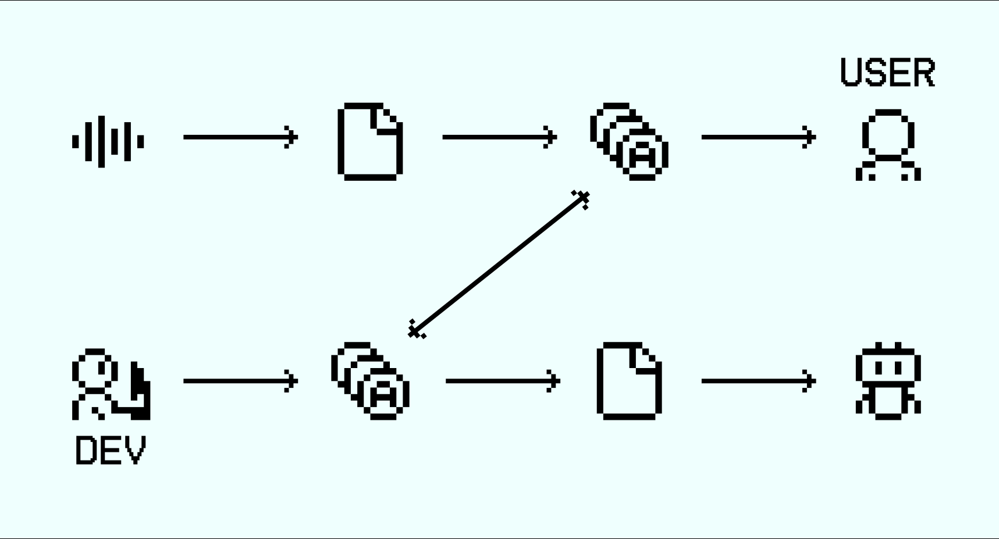

# DAO Token

### Token Overview

AudataDAO uses a native utility token, $AUDATA, to manage data ownership, access, governance, and value exchange within the protocol. Built on the Vana Blockchain, AudataDAO deploys the $AUDATA token directly on Vana to leverage its secure, user-owned data infrastructure.


### What is the Vana Blockchain?

The Vana network is an EVM-compatible layer-1 blockchain designed to restore individual control over personal data and enable user-owned AI through private and secure data transactions.

The platform has attracted top-tier investment from Paradigm and a16z, with recent strategic backing and advisory support from Changpeng “CZ” Zhao (former Binance founder).


### What is the purpose of the token?

The $AUDATA token serves four core purposes:

1. **Data monetization** — rewarding users for contributing audio data.
2. **Access control** — regulating developer access to encrypted datasets.
3. **DAO governance** — enabling contributors to participate in protocol governance, including decisions on dataset usage, treasury management, and protocol upgrades.
4. **Value alignment** — aligning incentives between users, developers, and the protocol.

### How token value is formed?

The value of $AUDATA is derived from real usage of the protocol. As demand for audio datasets increases, developers are required to acquire and burn tokens to access encrypted storage and enable model training. This creates a direct link between dataset usage and token demand.

Token value is therefore driven by:

* Growth in data contributions
* Increased developer adoption
* Expansion of machine learning use cases

### What is a token flow?

**Data contribution:** audio → encrypted storage → $AUDATA (distributed from Treasury)→ user

**Data usage:** developer → $AUDATA (burned) → encrypted storage → model training

<figure><figcaption></figcaption></figure>


#### Data Consumers (Developers)

Developers and ML specialists must acquire $AUDATA tokens to access encrypted storage and train models on the data. Tokens used for data access are burned, introducing a deflationary mechanism tied to real usage.



#### Data Contributors (Users)

Users receive $AUDATA tokens for uploading audio data to the protocol. Contributions are encrypted on the user’s device and stored securely. By holding tokens, contributors become DAO members with governance rights over the dataset and protocol decisions.


### What does the initial tokenomics look like?

<figure><figcaption></figcaption></figure>

The AudataDAO team does not charge platform fees. Instead, the team holds $AUDATA tokens and participates in DAO governance alongside the community. The team’s incentives are aligned with long-term protocol adoption, dataset usage, and ecosystem growth.

### Why we choose token-based data monetization?

Using $AUDATA eliminates the need for centralized data brokers and excessive platform fees. All value flows directly between contributors and developers through the protocol. This model ensures:

* Fair compensation for users.
* Predictable costs for developers.
* No hidden intermediaries.
* Secure and private data usage.

### How can I receive the token right now?

Check this section for the answer - [guide1.md](../../guides/guide1.md "mention").

